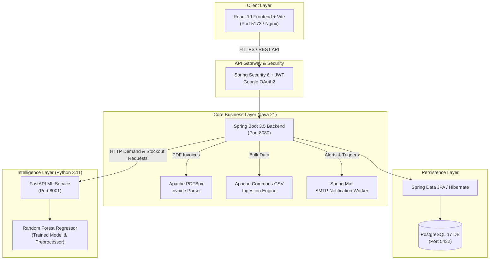

<div align="center">

<!-- Header Animated Waving Banner -->


<!-- Animated Typing Subtitle -->


<br>

<p align="center">
  
  
  
  
  
  
  
  
</p>

<!-- Live Operational Indicators -->
<p align="center">
  
  
  
  
</p>

<p align="center">
  <b>A resilient, distributed enterprise system bridging Java/Spring Boot microservices with Machine Learning to eliminate pharmaceutical stock-outs, forecast medicine demand spikes, and automate procurement lifecycles.</b>
</p>

</div>

---

### ⚡ Live AI Inference & Decision Simulation

<div align="center">

<!-- Animated Interactive Terminal Simulation -->


</div>

---

## 📑 Table of Contents

- [Overview](#-overview)
- [System Architecture](#-system-architecture)
- [Key Features](#-key-features)
- [Tech Stack](#-tech-stack)
- [Machine Learning & Forecasting Engine](#-machine-learning--forecasting-engine)
- [REST API Specifications](#-rest-api-specifications)
- [Automated Testing & Verification](#-automated-testing--verification)
- [Getting Started](#-getting-started)
  - [Prerequisites](#prerequisites)
  - [Option A: One-Command Docker Compose (Recommended)](#option-a-one-command-docker-compose-recommended)
  - [Option B: Local Unified Startup Script](#option-b-local-unified-startup-script)
- [Environment Configuration](#-environment-configuration)
- [Author & Connect](#-author--connect)

---

## 💡 Overview

Hospitals and pharmacies face critical risks when essential medicines run out of stock or expire unnoticed on warehouse shelves. Traditional inventory systems rely on manual stock audits, static reorder thresholds, and fragmented paper trails.

**StockUp AI** is an end-to-end intelligent inventory and decision-support platform designed to solve these challenges:
- **Zero Stock-Outs:** Leverages a trained **Random Forest Regressor** to predict daily and hourly medicine consumption spikes based on seasonality, lead times, and historical clinical trends.
- **Intelligent Safety Stock & Reordering:** Dynamically computes reorder points (ROP) and optimal order quantities based on live consumption rates and supplier reliability.
- **Automated Expiry & Batch Defense:** Tracks lot numbers, manufacturing dates, and shelf-life alerts with automated SMTP notifications.
- **Document & Data Extraction:** Automatically parses supplier PDF invoices (via **Apache PDFBox**) and ingests bulk CSV inventories (via **Apache Commons CSV**).
- **Secure Enterprise Multi-Tenant Core:** Protected with **Spring Security**, stateless **JWT tokens**, and **Google OAuth2** single sign-on.

---

## 🏛 System Architecture

The application is architected into decoupled, scalable microservices communicating over high-speed RESTful JSON channels:



---

## ✨ Key Features

| Domain | Highlights |
| :--- | :--- |
| 💊 **Medicine & Inventory Management** | Full CRUD operations, batch tracking, dosage strengths, categories, reorder levels, and real-time inventory adjustments. |
| 📈 **AI Demand Forecasting** | Predicts upcoming medicine demand using historical sales data and seasonal trend features via FastAPI and scikit-learn. |
| 🚨 **Stock-Out & Expiry Alerts** | Automated early warning system identifying batches approaching expiration or dipping below dynamic safety thresholds. |
| 🛒 **Procurement & Purchase Orders** | Complete procurement lifecycle: Purchase order generation, supplier confirmation, invoice parsing, and receiving inventory. |
| 💳 **POS Sales Billing** | Multi-item checkout, automated inventory deductions, receipt generation, and multi-currency conversion support. |
| 📄 **Smart Ingestion (PDF & CSV)** | Automated document ingestion using Apache PDFBox for invoice OCR/text extraction and bulk inventory CSV uploads. |
| 🔐 **Enterprise Security & RBAC** | Stateless JWT authentication, role-based authorization (Admin, Pharmacist, Staff), and Google OAuth2 integration. |
| 📊 **Analytics & Reporting** | Visual dashboards with interactive sales trends, stock velocity metrics, supplier lead times, and inventory valuation. |

---

## 🛠 Tech Stack

### Backend & Core Services
- **Language & Runtime:** Java 21 (LTS)
- **Framework:** Spring Boot 3.5.4
- **Persistence:** Spring Data JPA, Hibernate ORM
- **Database:** PostgreSQL 17 (Alpine container)
- **Security:** Spring Security, Stateless JWT (`jjwt 0.11.5`), Google API Client (OAuth2)
- **Data Utilities:** Apache PDFBox 3.0 (PDF Parsing), Apache Commons CSV 1.13
- **Monitoring & Health:** Spring Boot Actuator (`/actuator/health`)
- **Build Tool:** Apache Maven 3.9+

### Machine Learning & AI Microservice
- **Language & Runtime:** Python 3.11
- **API Framework:** FastAPI, Uvicorn
- **ML & Data Modeling:** scikit-learn, Random Forest Regressor, Pandas, NumPy, Joblib
- **Datasets & Training:** Hourly & daily pharmaceutical sales datasets (`saleshourly.csv`, `salesdaily.csv`)

### Frontend
- **Framework:** React 19 + Vite
- **Styling:** Modular CSS / Tailwind modern responsive layout
- **State Management:** Context API & Custom Hooks
- **Icons & Visuals:** Lucide Icons, Chart visualizations

### DevOps & Infrastructure
- **Containerization:** Docker & Docker Compose
- **Web Server & Reverse Proxy:** Nginx (Alpine)
- **Version Control:** Git, Git LFS (Large File Storage for ML models)

---

## 🧠 Machine Learning & Forecasting Engine

The demand forecasting pipeline is decoupled into a dedicated Python microservice:

```
[Historical Sales Data] ──► [Feature Engineering] ──► [Random Forest Regressor]
                                                              │
                                                              ▼
[Spring Boot Backend] ◄─── HTTP /predict (JSON) ◄─── [FastAPI Service :8001]
```

- **Features Used:** Lagged sales consumption, rolling mean averages, day-of-week seasonality, lead time variability, and category classification.
- **Inference Endpoints:**
  - `GET /health` – Real-time health check and model status.
  - `POST /predict` – Accepts real-time item velocity parameters and returns predicted consumption for the upcoming cycle.
  - `POST /daily_demand/predict` – Detailed daily demand forecasting with confidence intervals.

---

## 📡 REST API Specifications

The Spring Boot backend exposes a clean, standardized RESTful interface:

### 🔐 Authentication & Users
- `POST /api/auth/register` – Create new user account
- `POST /api/auth/login` – Authenticate with email/password and receive JWT
- `POST /api/auth/google` – Authenticate with Google ID token
- `POST /api/auth/forgot-password` & `/reset-password` – Automated password reset with email token
- `GET  /api/users/me` – Retrieve current user profile and role

### 💊 Medicines & Inventory
- `GET    /api/items` – Retrieve paginated medicine list with search & filter
- `POST   /api/items` – Add new medicine record with batch and expiry details
- `GET    /api/items/{id}` – Retrieve item details by ID
- `PUT    /api/items/{id}` – Update inventory attributes and stock quantities
- `DELETE /api/items/{id}` – Remove medicine item
- `POST   /api/items/bulk-upload` – Bulk upload medicines via CSV
- `POST   /api/ai/documents/parse-invoice` – Extract medicine data from PDF invoice (PDFBox)

### 🤖 AI Forecast & Predictions
- `POST /api/predictions/demand` – Query FastAPI ML service for medicine demand forecast
- `GET  /api/predictions/stockout-risk` – Identify items with high stock-out probability within lead time
- `GET  /api/reorder/optimize` – Calculate optimal reorder quantities and safety stock levels

### 🛒 Procurement & Purchase Orders
- `GET  /api/purchase-orders` – List all purchase orders
- `POST /api/purchase-orders` – Create new purchase order for supplier
- `PUT  /api/purchase-orders/{id}/status` – Transition order state (`PENDING` ➔ `CONFIRMED` ➔ `RECEIVED`)
- `GET  /api/suppliers` – Manage verified pharmaceutical suppliers

### 💳 Sales & POS Billing
- `POST /api/sales/bill` – Process POS checkout, compute tax, and decrement inventory
- `GET  /api/sales/history` – Query transactional sales ledger and receipts
- `GET  /api/reports/analytics` – Aggregate revenue, high-velocity items, and inventory turnover

---

## 🧪 Automated Testing & Verification

The repository includes rigorous end-to-end and integration test suites:

```bash
# Run Maven Backend Test Suite
cd stockup-backend
./mvnw clean test

# Run End-to-End Auth Verification Suite
python verify_auth_suite.py

# Run Complete Procurement & Order Lifecycle Verification
python verify_procurement_lifecycle.py

# Run Frontend POS Integration Suite
python test_pos_frontend_e2e.py
```

---

## 🚀 Getting Started

### Prerequisites
- **Git** & **Git LFS** installed
- **Docker** & **Docker Compose** *(for containerized setup)*
- Alternatively for local dev: **Java 21**, **Maven 3.9+**, **Python 3.11**, **Node.js 18+**, and **PostgreSQL 17**

---

### Option A: One-Command Docker Compose (Recommended)

Run the entire multi-service stack (Database, ML Service, Spring Boot Backend, and React Frontend) with a single command:

```bash
# 1. Clone the repository
git clone https://github.com/anish03-hub/STOCKUP-AI-FINAL.git
cd STOCKUP-AI-FINAL

# 2. Configure environment variables
cp .env.example .env

# 3. Build and launch all microservices
docker compose up --build -d
```

Once launched, access the services:
- **Web Application:** [http://localhost:5173](http://localhost:5173)
- **Spring Boot API:** [http://localhost:8080](http://localhost:8080)
- **Spring Boot Actuator Health:** [http://localhost:8080/actuator/health](http://localhost:8080/actuator/health)
- **FastAPI ML Service Health:** [http://localhost:8001/health](http://localhost:8001/health)
- **PostgreSQL Database:** `localhost:5432` (`db: stockup_ai`)

To stop all containers:
```bash
docker compose down
```

---

### Option B: Local Unified Startup Script

For active local development without Docker containers:

```bash
# 1. Ensure PostgreSQL is running on port 5432 with database 'stockup_ai'
# 2. Run the unified startup orchestrator
./start.sh
```

The startup script will:
1. Verify PostgreSQL connection health on `5432`
2. Launch and verify the FastAPI ML engine on `8001`
3. Launch the Spring Boot application on `8080`
4. Launch the React Vite development server on `5173`

To gracefully shut down all background instances:
```bash
./stop.sh
```

---

## ⚙️ Environment Configuration

Copy `.env.example` to `.env` and configure your credentials:

```ini
# PostgreSQL Database
DATABASE_URL=jdbc:postgresql://localhost:5432/stockup_ai
DATABASE_USERNAME=postgres
DATABASE_PASSWORD=your_secure_password

# JWT Security
JWT_SECRET=404E635266556A586E3272357538782F413F4428472B4B6250645367566B5970
JWT_EXPIRATION_MS=86400000

# Python ML Microservice
ML_API_URL=http://localhost:8001
REORDER_DEMAND_CSV_PATH=ml/medicine/data/saleshourly.csv

# Google OAuth2 (Optional)
GOOGLE_CLIENT_ID=your_google_client_id.apps.googleusercontent.com

# SMTP Mail Alerts (Optional)
MAIL_HOST=smtp.gmail.com
MAIL_PORT=587
MAIL_USERNAME=your_email@gmail.com
MAIL_PASSWORD=your_app_password
```

---

<div align="center">

## 👨‍💻 Author & Connect

**Anish Kumar Sah**  
*Java Developer | Spring Boot & REST APIs | B.Tech CSE @ Symbiosis Institute of Technology, Pune*

[](https://www.linkedin.com/in/anishsah)
[](mailto:sah42515@gmail.com)
[](https://github.com/anish03-hub)

<br>

<!-- Animated Waving Footer Banner -->


<sub>Built with ❤️ using Java 21, Spring Boot 3, FastAPI, and React 19. Designed for hospital and pharmaceutical reliability.</sub>

</div>
